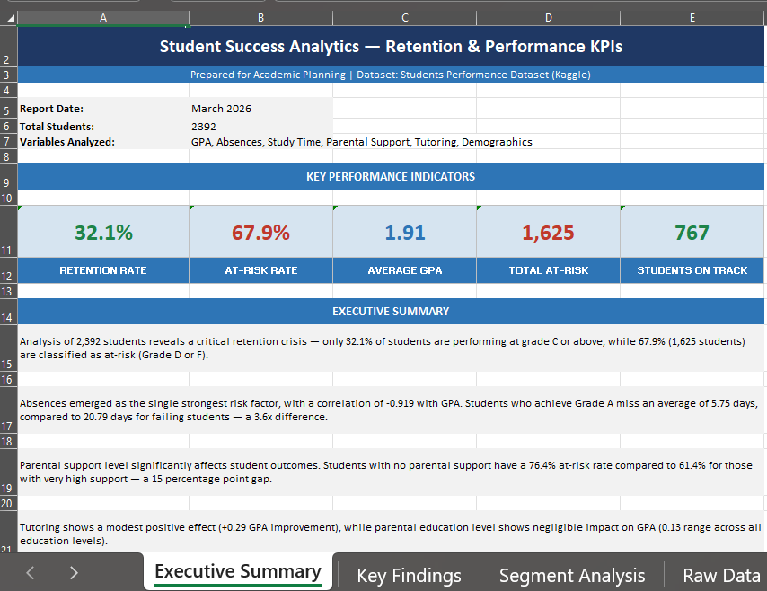
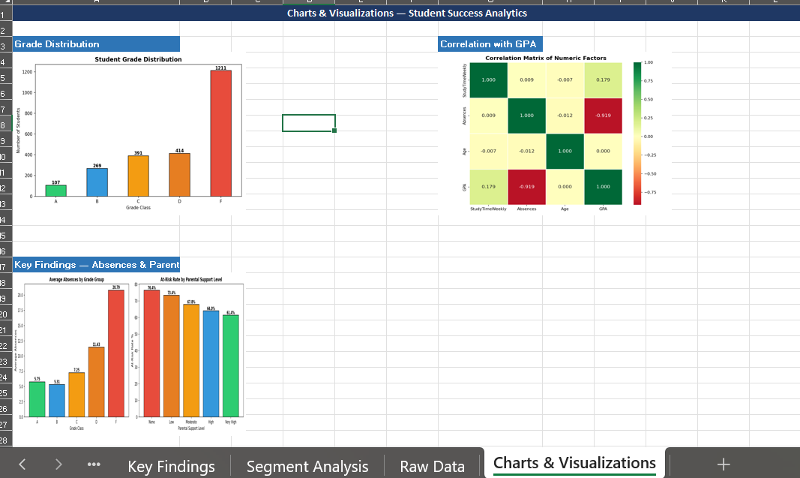

# 📊 Student Success Analytics: Retention & Performance KPIs

Statistical analysis of student academic performance and retention risk factors using Python, with stakeholder-ready Excel reporting.

---

## 📈 Project Preview

### Excel Report — Executive Summary


### Charts Preview


---

## 🎯 Problem Statement

> Identify key risk factors affecting student retention and academic performance, and quantify which student segments are most at risk of dropping out.

**Key questions answered:**
- What is the overall student retention rate?
- Which factors correlate most strongly with GPA?
- Which student segments have the highest dropout risk?
- Does parental support and tutoring affect performance?
- How do absences impact academic outcomes?

---

## 🔍 Key Findings

| # | Finding | Data |
|---|---|---|
| 1 | Average GPA is 1.91/4.0 — a broadly struggling student population | Mean = 1.91, Std = 0.92 |
| 2 | 50.6% of students are failing (Grade F) | F: 1,211 students |
| 3 | Overall retention rate is only 32.1% | On Track: 767 / 2,392 |
| 4 | Absences is the strongest risk factor | Correlation = -0.919 with GPA |
| 5 | Grade A students miss 5.75 days vs Grade F missing 20.79 days | 3.6x difference |
| 6 | Parental support significantly affects at-risk rate | None: 76.4% vs Very High: 61.4% |
| 7 | Tutoring improves GPA by 0.29 points | With: 2.11 vs Without: 1.82 |
| 8 | Parental education has negligible impact on GPA | Range: only 0.13 GPA points |
| 9 | Gender is not a meaningful risk differentiator | Female: 68.9% vs Male: 66.9% |

---

## 📁 Dataset

**Source:** [Students Performance Dataset — Kaggle](https://www.kaggle.com/datasets/rabieelkharoua/students-performance-dataset)

| Detail | Value |
|---|---|
| Total Records | 2,392 students |
| Features | 15 columns |
| Missing Values | None |
| Target Variable | GPA, GradeClass |

**Key columns used:**
- `GPA` → primary performance metric
- `GradeClass` → A/B/C/D/F outcome
- `Absences` → attendance behavior
- `StudyTimeWeekly` → study habits
- `ParentalSupport` → home environment
- `Tutoring` → academic intervention
- `Gender`, `Ethnicity`, `ParentalEducation` → demographic factors

---

## 🛠️ Tools & Technologies

| Tool | Purpose |
|---|---|
| **Python** | Data cleaning, statistical analysis, visualization |
| **pandas** | Data manipulation and aggregation |
| **scipy** | Statistical testing (ANOVA, correlation) |
| **matplotlib / seaborn** | Data visualization |
| **openpyxl** | Excel report generation |
| **Jupyter Notebook** | Analysis environment |
| **Git & GitHub** | Version control |

---

## 📐 Statistical Methods Used

| Method | Purpose | Result |
|---|---|---|
| Pearson Correlation | Measure relationship between numeric factors and GPA | Absences: -0.919, StudyTime: +0.179 |
| One-way ANOVA | Test if GPA differences across grade groups are significant | F=903.1, p≈0.000 |
| Segmentation Analysis | Group students by risk level, demographics, support factors | Retention Rate = 32.1% |

---

## 📋 Excel Report Structure

The stakeholder-ready Excel report contains 5 sheets:

| Sheet | Contents |
|---|---|
| Executive Summary | Headline KPIs, project overview, key narrative |
| Key Findings | All 9 findings with supporting data |
| Segment Analysis | GPA by grade group, parental support, tutoring |
| Charts & Visualizations | Grade distribution, correlation heatmap, key findings charts |
| Raw Data | Full cleaned dataset for self-service analysis |

---

## 🚀 How to Run Locally

### Prerequisites
```bash
pip install pandas numpy matplotlib seaborn scipy openpyxl jupyter
```

### Steps

1. **Clone the repository**
```bash
git clone https://github.com/Chandini149/student-success-analytics.git
```

2. **Download the dataset**
Download `StudentPerformanceFactors.csv` from [Kaggle](https://www.kaggle.com/datasets/rabieelkharoua/students-performance-dataset) and place it in the project folder.

3. **Run the notebook**
```bash
jupyter notebook
```
Open `student_success_analysis.ipynb` and run all cells.

4. **View the report**
Open `student_success_report.xlsx` in Microsoft Excel.

---

## 📂 Repository Structure

```
student-success-analytics/
│
├── student_success_analysis.ipynb   ← Python analysis notebook
├── student_success_report.xlsx      ← Stakeholder Excel report
│
├── plots/
│   ├── grade_distribution.png
│   ├── correlation_heatmap.png
│   └── key_findings.png
│
├── screenshots/
│   ├── executive_summary.png
│   └── charts_preview.png
│
└── README.md
```

---

## 💡 Recommendations for Academic Planning

Based on the analysis, three targeted interventions would have the highest impact:

1. **Attendance monitoring system** — Absences is the #1 risk factor (-0.919 correlation). Early alerts when students exceed 7 absences could prevent grade deterioration.

2. **Parental engagement programs** — Students with no parental support have a 76.4% at-risk rate. Structured parent communication programs could close the 15 percentage point gap.

3. **Targeted tutoring expansion** — Tutoring shows a +0.29 GPA improvement. Prioritizing tutoring for high-absence D/F students could have compounding benefits.
